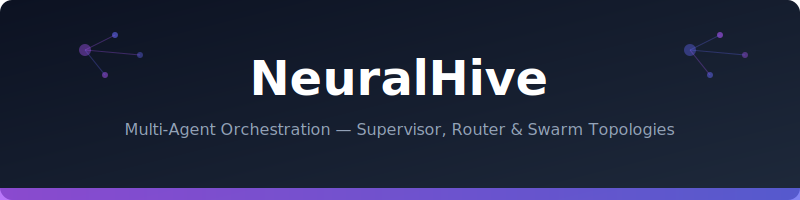

<div align="center">



# 🧠 NeuralHive

**Multi-Agent Orchestration Framework — Supervisor, Router, and Swarm Topologies**

[](https://python.org)
[](LICENSE)
[]()
[]()

*Build production multi-agent systems with pluggable routing, shared memory, and fault tolerance. Supports supervisor, peer-to-peer, hierarchical, and consensus topologies.*

</div>

---

## Why NeuralHive?

Single-agent architectures hit a wall at 5+ tools. NeuralHive provides:
- **Topology-agnostic orchestration** — same agents, different wirings
- **Shared memory** — agents read each other's outputs without message explosion
- **Fault isolation** — one agent fails, others continue with graceful degradation
- **Cost attribution** — per-agent token tracking for optimization

## Topologies

```
┌─────────────────────────────────────────────────────────┐
│ SUPERVISOR              ROUTER                          │
│                                                         │
│    ┌──────┐            ┌──────┐                         │
│    │ Boss │            │Router│                         │
│    └──┬───┘            └──┬───┘                         │
│   ┌───┼───┐           ┌───┼───┐                        │
│   ▼   ▼   ▼           ▼   ▼   ▼                        │
│  [A] [B] [C]         [A] [B] [C]                       │
│  Sequential           One-shot routing                  │
│                                                         │
│ HIERARCHICAL          CONSENSUS                         │
│                                                         │
│    ┌──────┐           ┌───┐ ┌───┐ ┌───┐                │
│    │ Lead │           │ A │↔│ B │↔│ C │                │
│    └──┬───┘           └───┘ └───┘ └───┘                │
│   ┌───┴───┐           All vote, majority wins          │
│   ▼       ▼                                            │
│ [Team1] [Team2]                                        │
│  ┌┴┐     ┌┴┐                                          │
│ [A][B]  [C][D]                                         │
└─────────────────────────────────────────────────────────┘
```

## Quick Start

```bash
pip install neuralhive
```

```python
from neuralhive import Hive, Agent, SupervisorTopology

# Define specialist agents
analyst = Agent(
    name="analyst",
    system_prompt="You analyze maintenance data and identify risks.",
    tools=[search_orders, get_order_details],
)

cost_expert = Agent(
    name="cost_expert",
    system_prompt="You analyze costs and budget variances.",
    tools=[get_costs, get_budget],
)

writer = Agent(
    name="writer",
    system_prompt="You synthesize findings into executive summaries.",
    tools=[],
)

# Create hive with supervisor topology
hive = Hive(
    agents=[analyst, cost_expert, writer],
    topology=SupervisorTopology(
        routing_strategy="sequential",  # or "parallel", "conditional"
    ),
)

result = await hive.run("What are the critical overdue orders and their cost impact?")
print(result.final_answer)
print(result.cost_breakdown)  # per-agent token costs
```

## Architecture

```python
from neuralhive import Hive, Agent, RouterTopology

# Router topology — single dispatch based on intent
hive = Hive(
    agents=[analyst, cost_expert, writer],
    topology=RouterTopology(),  # routes to best agent per query
)

# Consensus topology — all agents answer, majority/synthesized output
from neuralhive import ConsensusTopology
hive = Hive(
    agents=[agent_a, agent_b, agent_c],
    topology=ConsensusTopology(strategy="synthesis"),
)
```

## Features

| Feature | Description |
|---------|-------------|
| **4 Topologies** | Supervisor, Router, Hierarchical, Consensus |
| **Shared Memory** | Agents access prior outputs without message duplication |
| **Fault Tolerance** | Agent failures don't crash the hive; graceful degradation |
| **Cost Attribution** | Per-agent token tracking + budget limits |
| **Streaming** | SSE streaming from any topology |
| **Async Native** | Full async/await, concurrent agent execution |
| **Pluggable LLM** | Works with any LiteLLM-supported model |

## Documentation

- [Topology Comparison](docs/topologies.md)
- [Architecture Diagrams](docs/architecture.md)
- [Performance Benchmarks](docs/benchmarks.md)

## License

MIT
