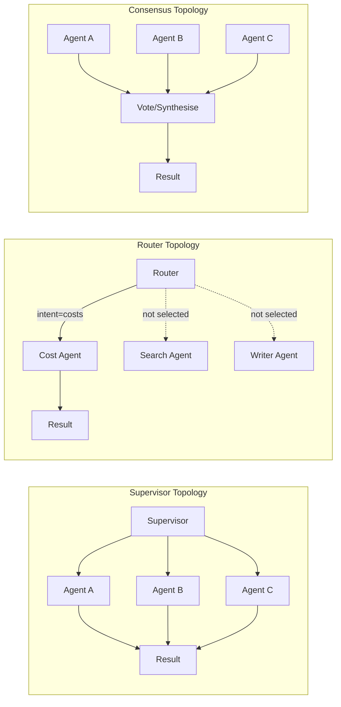
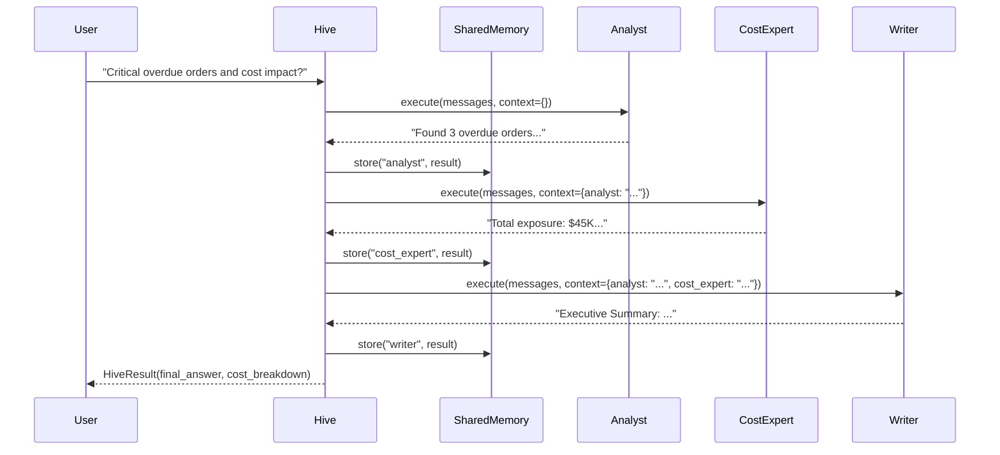
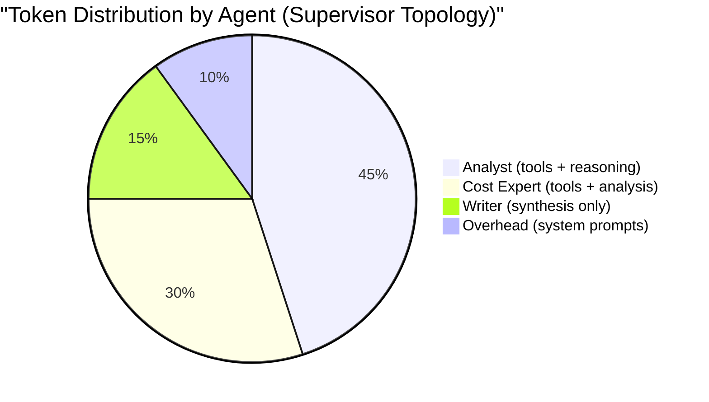
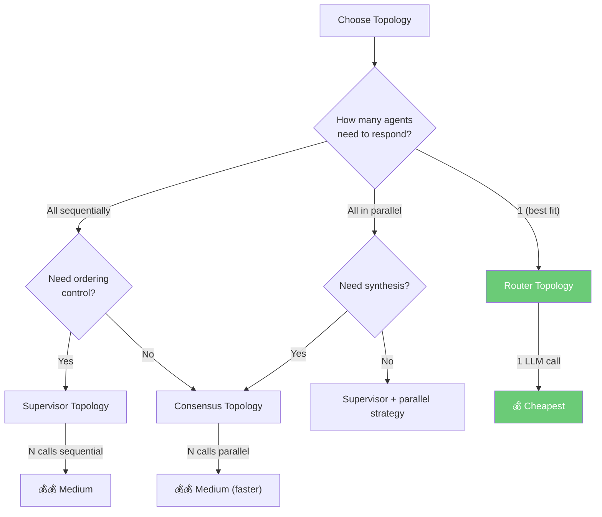
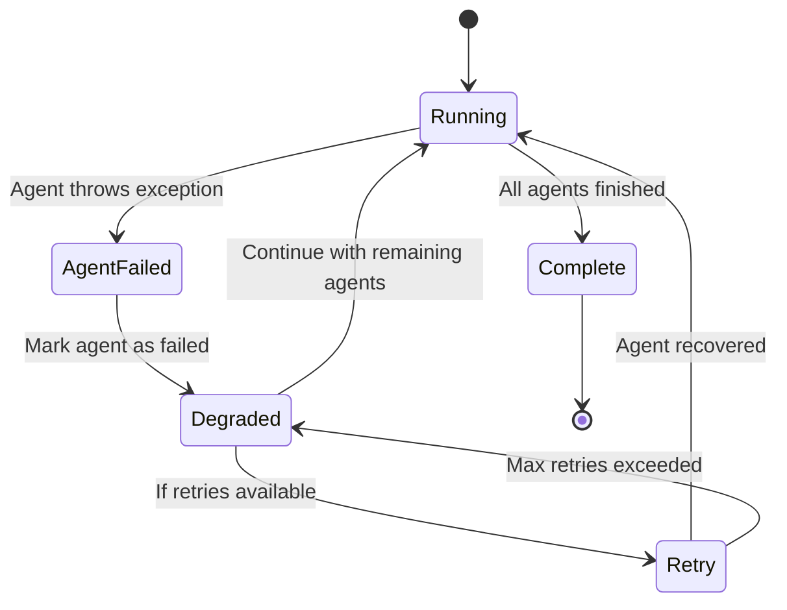

# NeuralHive Architecture

## Topology Comparison

```mermaid
flowchart LR
    subgraph Supervisor["Supervisor Topology"]
        direction TB
        S[Supervisor] --> A1[Agent A]
        S --> A2[Agent B]
        S --> A3[Agent C]
        A1 --> SR[Result]
        A2 --> SR
        A3 --> SR
    end

    subgraph Router["Router Topology"]
        direction TB
        R[Router] -->|"intent=costs"| B1[Cost Agent]
        R -.->|"not selected"| B2[Search Agent]
        R -.->|"not selected"| B3[Writer Agent]
        B1 --> RR[Result]
    end

    subgraph Consensus["Consensus Topology"]
        direction TB
        C1[Agent A] --> V[Vote/Synthesise]
        C2[Agent B] --> V
        C3[Agent C] --> V
        V --> CR[Result]
    end
```

## Message Flow: Supervisor Topology

```mermaid
sequenceDiagram
    participant User
    participant Hive
    participant Memory as SharedMemory
    participant Analyst
    participant CostExpert
    participant Writer

    User->>Hive: "Critical overdue orders and cost impact?"
    
    Hive->>Analyst: execute(messages, context={})
    Analyst-->>Hive: "Found 3 overdue orders..."
    Hive->>Memory: store("analyst", result)
    
    Hive->>CostExpert: execute(messages, context={analyst: "..."})
    CostExpert-->>Hive: "Total exposure: $45K..."
    Hive->>Memory: store("cost_expert", result)
    
    Hive->>Writer: execute(messages, context={analyst: "...", cost_expert: "..."})
    Writer-->>Hive: "Executive Summary: ..."
    Hive->>Memory: store("writer", result)
    
    Hive-->>User: HiveResult(final_answer, cost_breakdown)
```

## Cost Attribution

```mermaid
pie title "Token Distribution by Agent (Supervisor Topology)"
    "Analyst (tools + reasoning)" : 45
    "Cost Expert (tools + analysis)" : 30
    "Writer (synthesis only)" : 15
    "Overhead (system prompts)" : 10
```

## Topology Decision Tree

```mermaid
flowchart TD
    START[Choose Topology] --> Q1{How many agents\nneed to respond?}
    
    Q1 -->|"1 (best fit)"| ROUTER[Router Topology]
    Q1 -->|"All sequentially"| Q2{Need ordering\ncontrol?}
    Q1 -->|"All in parallel"| Q3{Need synthesis?}
    
    Q2 -->|Yes| SUPERVISOR[Supervisor Topology]
    Q2 -->|No| CONSENSUS[Consensus Topology]
    
    Q3 -->|Yes| CONSENSUS
    Q3 -->|No| PARALLEL[Supervisor + parallel strategy]

    ROUTER -->|"1 LLM call"| COST1["💰 Cheapest"]
    SUPERVISOR -->|"N calls sequential"| COST2["💰💰 Medium"]
    CONSENSUS -->|"N calls parallel"| COST3["💰💰 Medium (faster)"]

    style ROUTER fill:#6bcb77,color:#fff
    style COST1 fill:#6bcb77,color:#fff
```

## Fault Tolerance

```mermaid
stateDiagram-v2
    [*] --> Running
    Running --> AgentFailed: Agent throws exception
    AgentFailed --> Degraded: Mark agent as failed
    Degraded --> Running: Continue with remaining agents
    Degraded --> Retry: If retries available
    Retry --> Running: Agent recovered
    Retry --> Degraded: Max retries exceeded
    Running --> Complete: All agents finished
    Complete --> [*]
```
